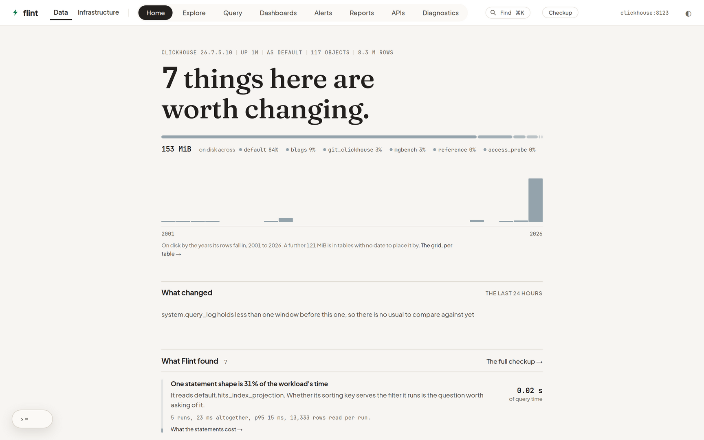
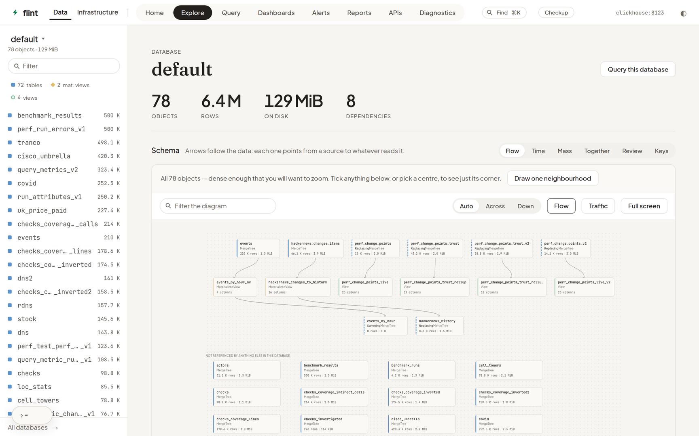

# Flint

**The workspace ClickHouse doesn't ship with.**

Flint is a self-hosted web interface for exploring, querying and operating
ClickHouse. It opens on a verdict about your server — the columns nothing has
read, the account that spent the week, the data held twice — and goes as far as
publishing a statement as a JSON API. Your schema is one click on, drawn rather
than listed. One Rust binary serves the API and embeds the built frontend, so a
deployment is one process and no second database.

Point it at a server and it changes nothing there: `FLINT_READONLY` is the
default in the shipped compose file, and without a workspace database Flint
writes nothing at all.

<picture>
  <source media="(prefers-color-scheme: dark)" srcset="docs/images/home-dark.png">
  
</picture>

<sub>A throwaway dev server seeded from ClickHouse's own playground schemas. Two
minutes of uptime is why <em>What changed</em> says it has nothing to compare
against yet rather than inventing a baseline — which is the point.</sub>

## Try it without a ClickHouse

The sign-in screen will open **ClickHouse's own public demo server** for you in
one press — 7 TiB and 246 billion rows, including every public GitHub event
since 2011, a decade of taxi trips, and the web-analytics set the benchmarks
use. No signup, no local server, no `.env`:

```bash
docker build -t flint:local . && docker run --rm -p 8080:8080 flint:local
```

Then press **Open the demo** on the sign-in screen.

Flint says up front what that account *withholds*, too: it is granted the schema
and the data, so the diagram, the types and the queries all work — but
`system.parts`, `system.disks` and `system.query_log` are refused there, so
storage, the workload and the checkup have nothing to answer with. Better said
before the click than discovered as four grey panels after it.

## Quick start

```bash
cp .env.example .env      # set FLINT_CLICKHOUSE_PASSWORD, and the URL if needed
docker compose up --build
```

Open <http://localhost:8080>.

Flint writes nothing anywhere until you name a database for it, so Dashboards,
Alerts, Reports and APIs are absent from the bar on a first run rather than
present and failing. One line in `.env` turns them on, and it is safe alongside
the read-only default — that refuses writes to *your* data, and this is Flint's
own database:

```bash
FLINT_WORKSPACE_DATABASE=flint
```

If your ClickHouse is bound to the host's **loopback only** — which is what
`kubectl port-forward` and Tilt give you — a bridged container cannot see it,
whatever address you use. Add the host-network overlay:

```bash
docker compose -f docker-compose.yml -f docker/host.yml up --build
```

Without compose:

```bash
docker build -t flint:local .

docker run --rm -p 8080:8080 \
  -e FLINT_CLICKHOUSE_URL=http://clickhouse:8123 \
  -e FLINT_CLICKHOUSE_USER=explorer \
  -e FLINT_CLICKHOUSE_PASSWORD=... \
  -e FLINT_READONLY=true \
  flint:local
```

One stage compiles the frontend, one compiles the binary with the frontend
embedded, and the runtime image is `distroless/cc` carrying nothing but Flint —
34 MB. That image has no shell and no curl, so the container healthcheck is the
binary itself (`flint --health-check`).

## What it does

Flint is two products in one binary, kept apart in the UI. **Data** works on
rows; **Infrastructure** works on structure and on the server. See
[the two spaces](docs/design.md#the-two-spaces) for why.

**Data**

- **Home** — a verdict on the server and the findings behind it, on arrival and
  without being asked: which of the disk nothing has read, who has been spending
  the week, the data held twice. It owns none of them — every one is also on the
  page that acts on it — and it will not clear a server it was not allowed to
  read, naming the grants that never voted.
- **Explore** — the schema as a diagram, with lineage both ways, per-column
  profiles, storage broken down by column and codec, and the same database on
  its time axis.
- **Query** — a SQL editor with completion that only offers what would work
  here, or the same query built without typing; a results grid you can edit the
  query from; `EXPLAIN` read back as sentences.
- **Keep** — saved queries, charts the result suggests itself, and dashboards.
- **Watch** — alerts as a question asked on a schedule, and reports of what the
  numbers were, delivered to a webhook.
- **Publish** — a statement exposed as a JSON API with typed parameters, an
  OpenAPI document, hashed tokens and per-key quotas.

<picture>
  <source media="(prefers-color-scheme: dark)" srcset="docs/images/explore-dark.png">
  
</picture>

**Infrastructure**

- **Health** — replication, parts, merges, mutations, free space, and what is
  running right now.
- **Diagnostics** — which queries cost what, and *why* the expensive ones are
  expensive, with Flint's own traffic left out.
- **Schema review** — column types weighed as one decision each, and the
  projections the workload actually argues for.
- **Access** — grants, row policies and quotas, read as who can do what.
- **Operations** — `ALTER`s that say what they cost before the button, backups,
  and long operations recorded as rows rather than spinners.

Every cap, fold and filter states its own count, and a figure that cannot be had
is dropped rather than dashed. The [full feature guide](docs/features.md) walks
through all of it.

## Why another one

The usual shape for a ClickHouse front-end is a query console: a box, a grid, a
history. Flint has that box, but it is not what the product is for.

- **It arrives with an opinion.** A console opens empty and waits for you to
  already know what to ask. Flint's `/` is a verdict it measured before you
  typed anything, and every finding on it is also on the page that can act on
  it.
- **It has a second half.** Replication, parts, merges, grants, `ALTER`s that
  price themselves before the button — the operating surface, kept in its own
  space so somebody working on rows never trips over it.

Two things it is deliberately not. It is not a BI tool: Metabase and Superset
are better at charts for people who will never write SQL. And it is not a
multi-database client: DBeaver and DataGrip speak twenty dialects, where Flint
speaks one and knows what `system.parts` means.

## From Kubernetes

Where ClickHouse only exists inside a cluster, `flint k8s` is the whole start:

```bash
flint k8s -n play-clickhouse sts/clickhouse
```

It resolves the workload to one pod, opens a `kubectl port-forward` to it, reads
the credentials the pod template *declares*, and boots the ordinary Flint against
the tunnel — naming each of those in its output as it goes. Targets are spelled
as `kubectl` spells them (`sts/`, `svc/`, `pod/`, `chi/`, or a bare name read as
a StatefulSet) and `kubectl` is what it shells out to, so your context, your exec
plugin and your OIDC all work because they already work.

Two things it will not do: guess — nothing sweeps the namespace for a secret
whose name looks promising — and assume you meant to write, resolving to the
`read` tier unless `--tier` says otherwise.

[What it reads, the full output, and what it does when it cannot](docs/configuration.md#starting-from-kubernetes).

## Configuration

Every option is a flag or an environment variable, and `flint --help` lists them
all. These are the ones a first deployment actually sets:

| Variable                    | Default   | What it does                                                                        |
| --------------------------- | --------- | ----------------------------------------------------------------------------------- |
| `FLINT_CLICKHOUSE_URL`      | —         | ClickHouse HTTP endpoint. Unset = unpinned: the browser names the server at sign-in |
| `FLINT_CLICKHOUSE_USER`     | `default` | ClickHouse user                                                                     |
| `FLINT_CLICKHOUSE_PASSWORD` | *empty*   | ClickHouse password                                                                 |
| `FLINT_READONLY`            | `false`   | Send `readonly=2`: writes are refused                                               |
| `FLINT_AUTH`                | `false`   | Require everyone to sign in with their own ClickHouse credentials                   |
| `FLINT_WORKSPACE_DATABASE`  | —         | Where Flint may keep its own metadata. Unset = stateless                            |

<details>
<summary>Every other variable</summary>

| Variable                    | Default                  | What it does                                                                  |
| --------------------------- | ------------------------ | ----------------------------------------------------------------------------- |
| `FLINT_CLICKHOUSE_CA_CERT`  | —                        | PEM bundle for a private CA                                                   |
| `FLINT_CLICKHOUSE_DATABASE` | `default`                | Database the editor starts in                                                 |
| `FLINT_CORS_ORIGIN`         | —                        | Extra allowed origin (dev only)                                               |
| `FLINT_HOST`                | `0.0.0.0`                | Bind address                                                                  |
| `FLINT_INFRASTRUCTURE`      | `true`                   | Whether the Infrastructure space exists in the UI                             |
| `FLINT_LOG`                 | `flint=info`             | `tracing` filter                                                              |
| `FLINT_MAX_RESULT_ROWS`     | `10000`                  | Row cap per query                                                             |
| `FLINT_PORT`                | `8080`                   | Bind port                                                                     |
| `FLINT_QUERY_TIMEOUT_SECS`  | `120`                    | Server-side query timeout                                                     |
| `FLINT_SESSION_IDLE_HOURS`  | `12`                     | How long an unused session survives                                           |
| `FLINT_TARGETS`             | *any*                    | Servers a browser may point an unpinned Flint at. Ignored when the URL is set |
| `FLINT_TIER`                | follows `FLINT_READONLY` | What this deployment may do: `read`, `data`, `ddl`, `admin`                   |
| `FLINT_WORKSPACE_PASSWORD`  | —                        | Password for the workspace database                                           |
| `FLINT_WORKSPACE_URL`       | —                        | A server of Flint's own to keep that metadata on. Unset = the explored one    |
| `FLINT_WORKSPACE_USER`      | `default`                | Account on the workspace server. Not inherited from the explored one          |

</details>

The three options that are more than a value — grants, signing in, and running
without a server in the manifest — are explained in
[docs/configuration.md](docs/configuration.md).

### Statefulness, in one paragraph

Unset `FLINT_WORKSPACE_DATABASE` and Flint remembers nothing — no saved queries,
no dashboards, no alerts, and nothing written to the server you point it at.
Set it and Flint keeps its own tables in ClickHouse, never in a second datastore.
`FLINT_WORKSPACE_URL` decides *which* ClickHouse: unset, the one being explored;
set, a server of Flint's own, which is what makes "connecting Flint creates
nothing" literally true and what lets an unpinned Flint remember anything at all.

## Development

Everything in containers, hot reload on both sides, against a throwaway
ClickHouse seeded from [play.clickhouse.com](https://play.clickhouse.com):

```bash
docker compose -f docker/dev.yml up --build
```

Open <http://localhost:5173>.

```bash
make lint          # clippy -D warnings + rustfmt --check + tsc + oxlint
make test          # cargo test + vitest
make build         # frontend, then the release binary that embeds it
make run           # the API on its own
make help          # every target
```

`make lint` and `make test` are what CI runs, and nothing else. Full notes,
including the seed schema and the check scripts, are in
[docs/development.md](docs/development.md).

## Documentation

| Document                                       | What is in it                                                                            |
| ---------------------------------------------- | ---------------------------------------------------------------------------------------- |
| [docs/features.md](docs/features.md)           | Every feature, in the order somebody meets it                                            |
| [docs/configuration.md](docs/configuration.md) | Grants Flint needs, signing in, running unpinned                                         |
| [docs/design.md](docs/design.md)               | The two spaces, the tiers, the visual language, and the design decisions behind the code |
| [docs/development.md](docs/development.md)     | The dev stack, the seed schema, the check scripts                                        |
| [docs/limitations.md](docs/limitations.md)     | What is missing inside the features that exist                                           |
| [docs/roadmap.md](docs/roadmap.md)             | Where this is going                                                                      |
| [CLAUDE.md](CLAUDE.md)                         | Conventions for working in this repository                                               |

## Status

`v0.1`. Every feature in the brief is built at least once; what is missing
*inside* them is written down in [docs/limitations.md](docs/limitations.md)
rather than left to be discovered.

## License

[Apache-2.0](LICENSE).
